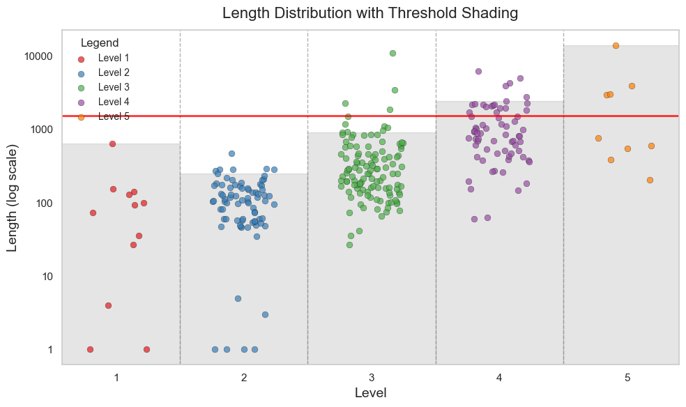
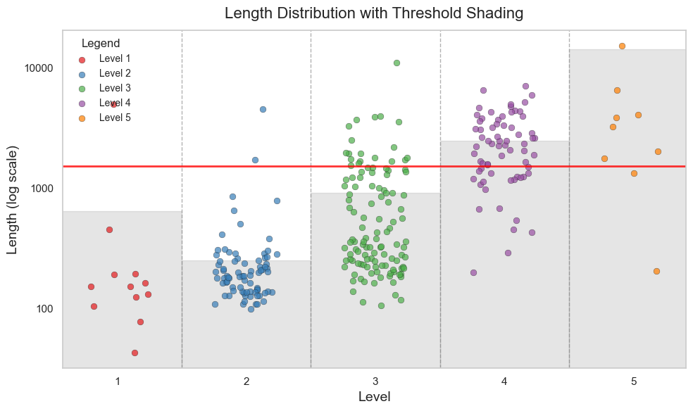
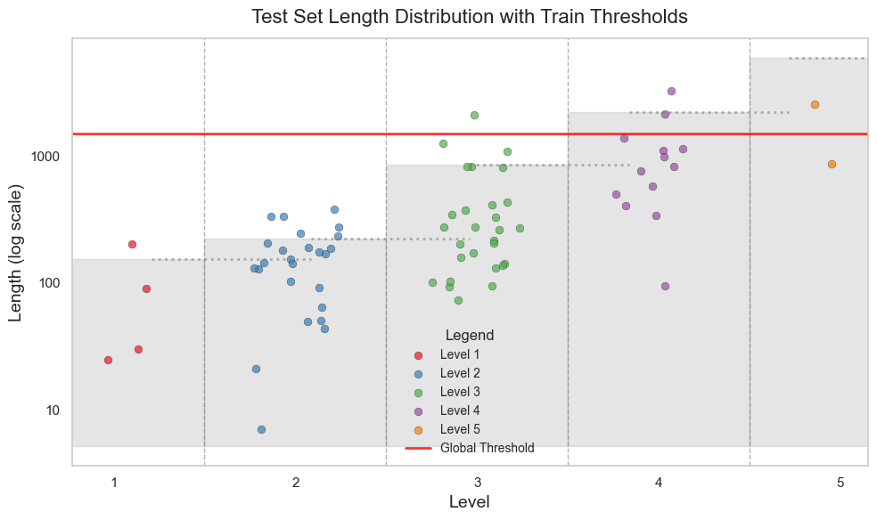
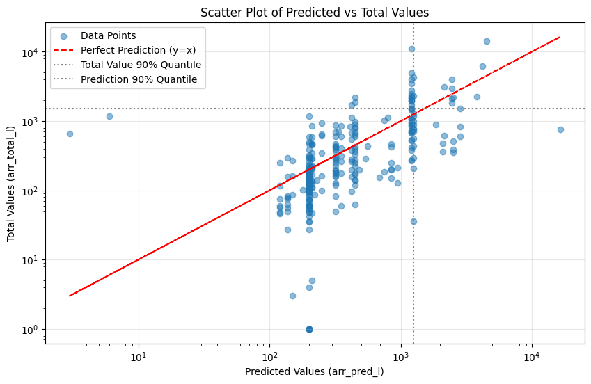
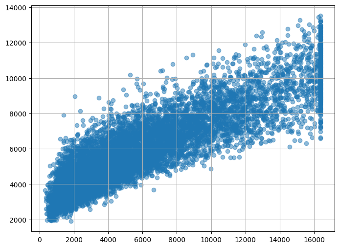
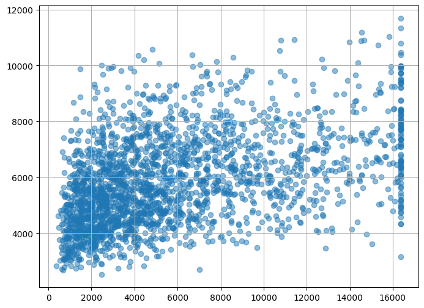
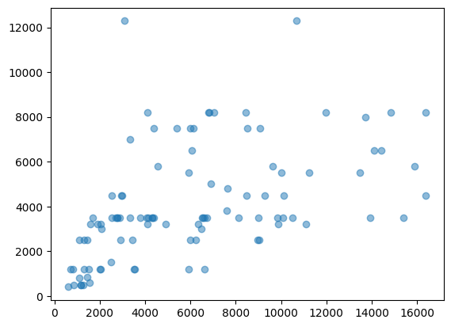

### this is quick note

I conducted a small experiment. Overall, I used 150 samples from the MATH-500 dataset as a calibration set, aiming to identify a meaningful quantile.

Some quick look about this dataset

Experiment Setting
| type | Reasoning Model                    | Judge Model                  | Pred_length Model            |
|------|------------------------------------|------------------------------|------------------------------|
| Model| DeepSeek-R1-Distill-Qwen-32B       | Qwen/Qwen2.5-14B-Instruct    | Qwen/Qwen2.5-14B-Instruct    |

To simplify the process, I'm currently searching by 1%, 2%, ... up to 100% instead of token-by-token.

Here, the `min_valid_length` is the minimum value of $k$ such that for all $k' \geq k$, the first $k'$ tokens can output the same answer as the answer after full reasoning.

I am using MATH-500 as the calibration set, which contains nearly 300 data points.

### Algorithm 0 & 1
- **Algorithm 0** uses a unique threshold for all problems.
- **Algorithm 1** uses deepseek-chat to divide the problems into 5 levels based on their difficulty. For each difficulty level, a different threshold is set.

The results in the calibration set are as follows:

- The red line represents the threshold from Algorithm 0.
- The different gray shades represent various thresholds for different difficulty levels.

Next, let's examine the relationship between the original length and the threshold:

We compute the reduction ratio as:
$$
\text{Reduction Ratio} = \frac{\sum \max(\text{original\_length} - \text{threshold}, 0)}{\sum \text{original\_length}}
$$

| Level 1 | Level 2 | Level 3 | Level 4 | Level 5 |
|---------|---------|---------|---------|---------|
| 79.15%  | 58.60%  | 43.60%  | 50.89%  | 30.13%  |

- Note that this method helps save more resources for easier problems.
- The reduction ratio can serve as a flag for choosing the optimal nonconformity score.

#### Test

We tested on the same dataset (MATH-500), and the accuracy was maintained:

However, when testing on a different, more difficult dataset (AIME 2024), the results are as follows:
- Using Algorithm-0, we found that only 12 out of 30 (40\%) of the cut data can output the same result as the full reasoning result.
- Using Algorithm-1, for Level 4, the ratio is 9 out of 14 (64\%). For Level 5, the ratio is 7 out of 15 (46\%).
- **Note**: This dataset is not perfect. In the 30 data points, 10 data entries had an invalid final result (""). In these cases, the judge LLM generally considers that the output cannot match the full reasoning.

### Algorithm 2

Here, we use the $\frac{min\_valid\_length}{pred\_length}$ as the nonconformity score, where $pred\_length$ is the prediction from deepseek. We found that the threshold is 2.13, and the relationship between the prediction and real values is shown below:

- The log-axis seems to provide a slightly better fit, but the difference between the predicted and actual values remains noticeable.
- Using this nonconformity score in the calibration data, we get the following reduction ratio:
$$
\text{Reduction Ratio} = \frac{\sum \max(\text{original\_length} - \text{threshold}\cdot \text{pred\_length}, 0)}{\sum \text{original\_length}} = 0.27
$$
    the reduction ratio is smaller than the algorithm-1
### Future Work

Dividing data into different difficulty levels is a simple and useful method. Using prediction length serves a similar purpose, but the performance of the predictions is not very good.

1. Use better signals to find the optimal nonconformity score.
2. When a calibration threshold is found for one dataset, we may encounter a distribution shift when applying it to a new dataset. Solving this problem is an important question.
3. Which dataset should we use for calibration?
4. some more useful-idea?

<!-- the relationship between min valid length and pred length
 -->

---
-----old note about how to predict the reasoning length----

I used Open-Thought's math dataset (which has a judged reasoning dataset, and the reasoning process is generated from DeepSeek-R1, so we do not need to collect much data ourselves). And after training a model, we can perform a linear transformation to adjust the mean and variance to fit the new LLM(eg:gpt-o1...).

Firstly, I used the input problem's embedding(embedding by a BERT model) and problem's length to train a random forest (https://arxiv.org/pdf/2406.04785). Here, I used nearly ten thousand math problems to train a random forest to predict the reasoning token length of R1. The training and testing results are:

Then, I tried letting the LLM predict the problem's reasoning length by selecting few-shot examples. Specifically, the prompt includes five math problems, with difficulty levels corresponding to the DeepSeek reasoning length (I chose these five problems by selecting the 20%, 40%... quantiles of reasoning length from 10,000 Open-Thought dataset). Then, I let DeepSeek-Chat think briefly and give the predicted length. I tested 100 problems, and this picture shows the true reasoning length and the predicted reasoning length.

Two ways can provide kind of correctness but not precise.

- The advantage of using a small random forest model is that it is quick and donnot need many resource.

- The advantage of using an LLM to predict is that we can provide the problem's difficulty level at the same time. This seems more reasonable, and we can use the difficulty level later. 
However, after reviewing some examples, I think it’s easier for the LLM to judge whether a question is easy. If we can provide some examples of reasoning lengths, its predictions for both difficulty level and length would be more precise relatively. But when the problem is difficult (the dataset includes some Olympic problems, like algebra and graph theory), neither humans (myself) nor the LLM can predict the reasoning length and difficulty level accurately, and some long enumeration may occur in the reasoning process. Most of the time, it may predict a shorter reasoning length than the true one from DeepSeek.

<!-- A thing that I think we can do is to use conditional conformal prediction. The class is determined by the LLM (or other methods), and the problem type (math, code, or common sense). Then, we can find a threshold (quantile) to ensure the correctness of new data. However, I think the nonconformity score defined as:
$\text{nonconformity score} = \frac{\min (\text{valid length})}{\text{predicted length}}$
is for the similar purpose? We can try some experiments.

Currently, the main cost comes from API calls. I can deploy models with 2B or 1.5B parameters, but I don't have the resources to use larger models. -->

### Some Note

1. The reasons why the min_valid_percent is 100 maybe
     - the full reasoning process is too long so the result maybe None (because it more than the defined max token)  (mainly)
     - the answer after the full reasoning process is wrong, but the answer by judge LLM is correct (a few)
     - I simply use == or in to check the answer, it useful in almost math problem, but in some case the form of output may different, maybe we can use a simple llm to judge whether the output is same, but in this case I jump this process.
     - APIError. Because I call the API in parallel, and in very rare cases, it gets blocked and causes issues.
 
2. Another gap is that, in the calibration step, we use a cheaper LLM to judge whether the reasoning step can generate the final answer, but in the real case we just cut up to the threshold and let the LLM continue generate. So maybe the judge answer is include the judge LLM's information, but, if the ability of judge LLM is less than the real LLM, it donot hurt the accuracy. 

### Future Work

1. We need to verify whether the quantile is accurate on the test dataset. This requires conducting some comparative experiments.

    One idea is to use the text continuation mode, where we input:

     {problem} <think>: {truncated reasoning process} <think>

    to prompt the model to continue generating the reasoning. We can then compare this output to the result generated through full reasoning. However, the API I am currently using does not seem to support this type of service, so I may explore other options :(.

2. It is challenging to directly query an LLM for its predicted reasoning length. However, there are some potential approaches we could try:
   - Use few-shot prompting, e.g., by providing a few reasoning examples.
   - I came across a paper that predicts the generation length of LLMs using user input length, application-level semantics, and user-level semantics (https://arxiv.org/pdf/2406.04785). I may try to adopt their approach, which involves training a Random Forest Regressor.

3. I need to read more papers...
