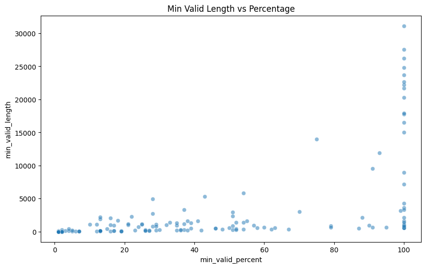
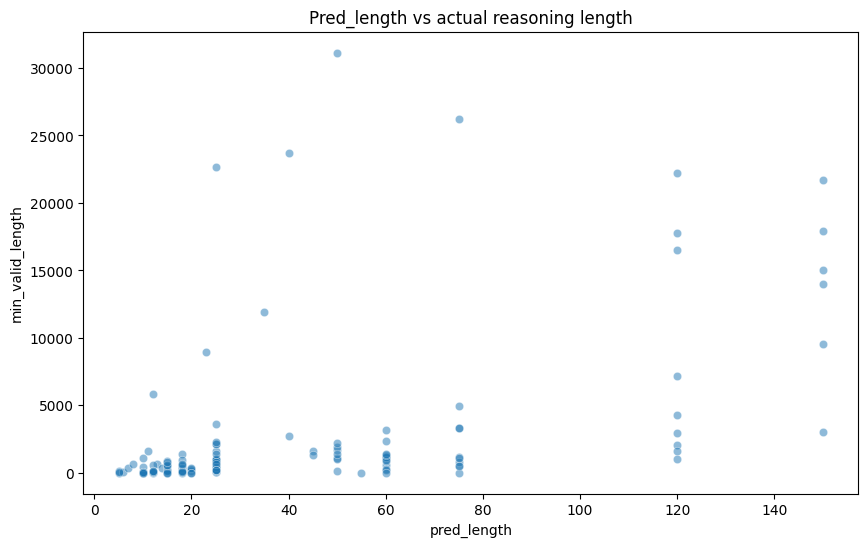
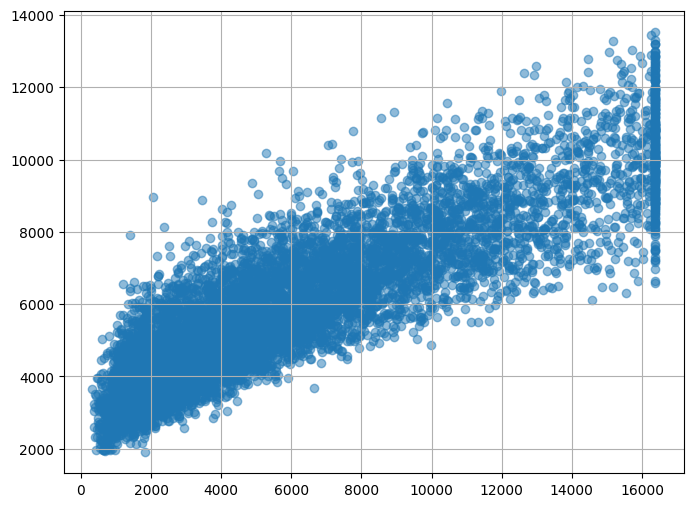
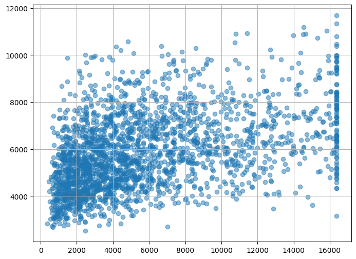
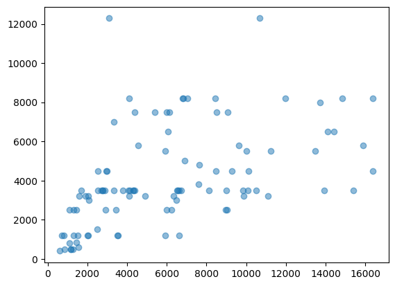

### this is quick note

I conducted a small experiment. Overall, I used 150 samples from the MATH-500 dataset as a calibration set, aiming to identify a meaningful quantile.

Some quick look about this dataset

Experiment Setting
| type | Reasoning Model                    | Judge Model                  | Pred_length Model            |
|------|------------------------------------|------------------------------|------------------------------|
| Model| DeepSeek-R1-Distill-Qwen-32B       | Qwen/Qwen2.5-14B-Instruct    | Qwen/Qwen2.5-14B-Instruct    |

To simplify the process, I'm currently search by 1%, 2%, ... 100% instead of token by token.(however,the code has been advanced to use binary search, so we can search token by token and the complexity would not increas significantly)

here the min_valid_length is the minist k that using the firsk k reasonging process can llm output the same answer as the answer after full reasoning.

the min_valid_percent is  $\frac{min\ valid \ length}{full \  reasoning \  length}\cdot 100$

|       index       | min_valid_length | min_valid_percent |
|------------------|------------------|-------------------|
| mean             | 3028.476510      | 43.550336         |
| std              | 6404.572198      | 35.975486         |
| min              | 4.000000         | 1.000000          |
| 25%              | 106.000000       | 13.000000         |
| 50%              | 603.000000       | 35.000000         |
| 75%              | 1638.000000      | 79.000000         |
| max              | 31147.000000     | 100.000000        |

the relationship between min valid length and min valid percent

<!-- the relationship between min valid length and pred length
 -->

- the quantile

    | $\alpha$ | $\hat{\tau}$ |
    |----------|--------------|
    | 0.1      | 12098.033557047002 |
    | 0.2      | 2433.9463087248396 |
    | 0.3      | 1360.5906040268455 |

The range of the reasoning length is too large, and we can see that the longer the reasoning length is, the larger the minimum percentage becomes. If we only use $\hat \tau$ to cut the reasoning process, we cannot guarantee the accuracy for difficult problems.
### About the prediction length
I tried some methods to predict the reasoning length of an LLM.

I used Open-Thought's math dataset (which has a judged reasoning dataset, and the reasoning process is generated from DeepSeek-R1, so we do not need to collect much data ourselves). And after training a model, we can perform a linear transformation to adjust the mean and variance to fit the new LLM(eg:gpt-o1...).

Firstly, I used the input problem's embedding(embedding by a BERT model) and problem's length to train a random forest (https://arxiv.org/pdf/2406.04785). Here, I used nearly ten thousand math problems to train a random forest to predict the reasoning token length of R1. The training and testing results are:

Then, I tried letting the LLM predict the problem's reasoning length by selecting few-shot examples. Specifically, the prompt includes five math problems, with difficulty levels corresponding to the DeepSeek reasoning length (I chose these five problems by selecting the 20%, 40%... quantiles of reasoning length from 10,000 Open-Thought dataset). Then, I let DeepSeek-Chat think briefly and give the predicted length. I tested 100 problems, and this picture shows the true reasoning length and the predicted reasoning length.

Two ways can provide kind of correctness but not precise.

- The advantage of using a small random forest model is that it is quick and donnot need many resource.

- The advantage of using an LLM to predict is that we can provide the problem's difficulty level at the same time. This seems more reasonable, and we can use the difficulty level later. 
However, after reviewing some examples, I think it’s easier for the LLM to judge whether a question is easy. If we can provide some examples of reasoning lengths, its predictions for both difficulty level and length would be more precise relatively. But when the problem is difficult (the dataset includes some Olympic problems, like algebra and graph theory), neither humans (myself) nor the LLM can predict the reasoning length and difficulty level accurately, and some long enumeration may occur in the reasoning process. Most of the time, it may predict a shorter reasoning length than the true one from DeepSeek.

A thing that I think we can do is to use conditional conformal prediction. The class is determined by the LLM (or other methods), and the problem type (math, code, or common sense). Then, we can find a threshold (quantile) to ensure the correctness of new data. However, I think the nonconformity score defined as:
$\text{nonconformity score} = \frac{\min (\text{valid length})}{\text{predicted length}}$
is for the similar purpose? We can try some experiments.

Currently, the main cost comes from API calls. I can deploy models with 2B or 1.5B parameters, but I don't have the resources to use larger models.

### Some Note

1. The reasons why the min_valid_percent is 100 maybe
     - the full reasoning process is too long so the result maybe None (because it more than the defined max token)  (mainly)
     - the answer after the full reasoning process is wrong, but the answer by judge LLM is correct (a few)
     - I simply use == or in to check the answer, it useful in almost math problem, but in some case the form of output may different, maybe we can use a simple llm to judge whether the output is same, but in this case I jump this process.
     - APIError. Because I call the API in parallel, and in very rare cases, it gets blocked and causes issues.
 
2. Another gap is that, in the calibration step, we use a cheaper LLM to judge whether the reasoning step can generate the final answer, but in the real case we just cut up to the threshold and let the LLM continue generate. So maybe the judge answer is include the judge LLM's information, but, if the ability of judge LLM is less than the real LLM, it donot hurt the accuracy. 

### Future Work

1. We need to verify whether the quantile is accurate on the test dataset. This requires conducting some comparative experiments.

    One idea is to use the text continuation mode, where we input:

     {problem} <think>: {truncated reasoning process} <think>

    to prompt the model to continue generating the reasoning. We can then compare this output to the result generated through full reasoning. However, the API I am currently using does not seem to support this type of service, so I may explore other options :(.

2. It is challenging to directly query an LLM for its predicted reasoning length. However, there are some potential approaches we could try:
   - Use few-shot prompting, e.g., by providing a few reasoning examples.
   - I came across a paper that predicts the generation length of LLMs using user input length, application-level semantics, and user-level semantics (https://arxiv.org/pdf/2406.04785). I may try to adopt their approach, which involves training a Random Forest Regressor.

3. I need to read more papers...
